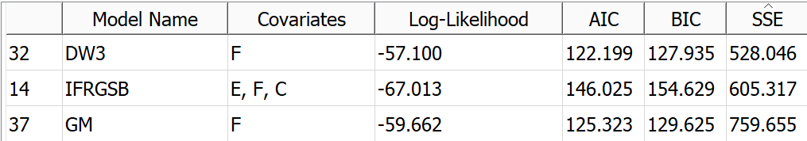
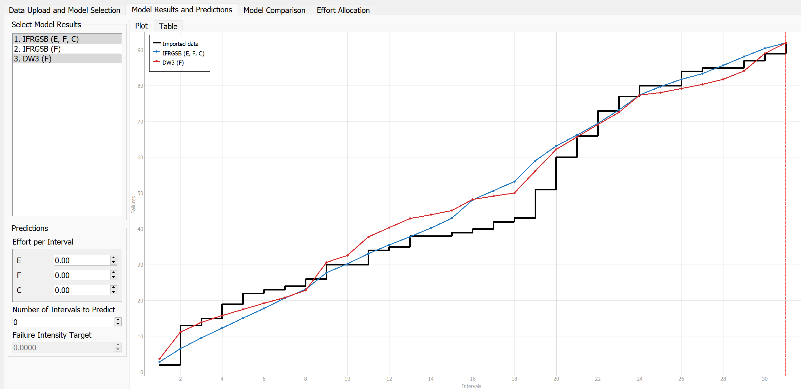
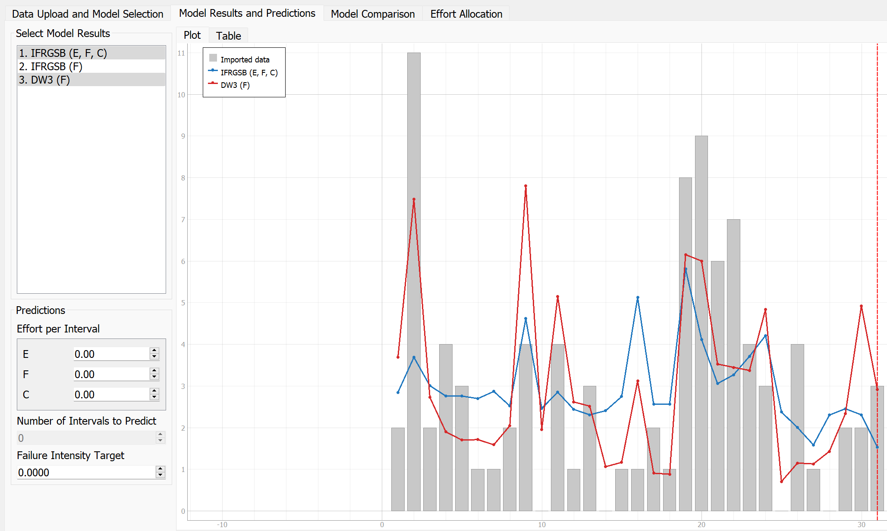
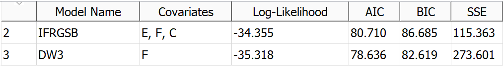
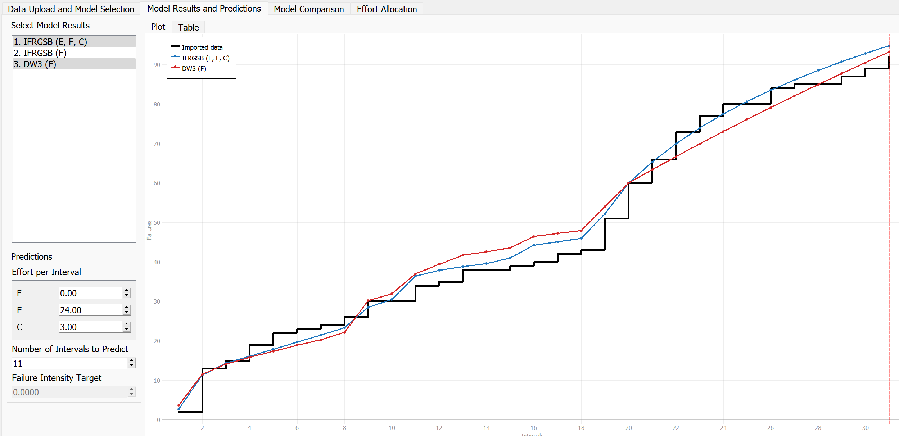
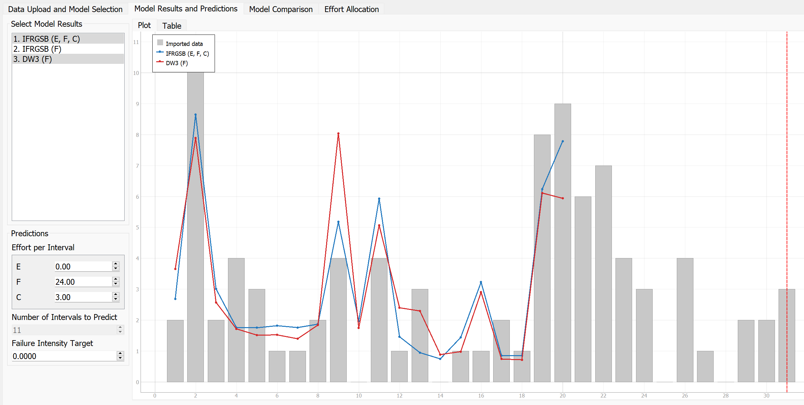

**SENG 637- Dependability and Reliability of Software Systems***

**Lab. Report \#5 – Software Reliability Assessment**

| Group \#:       |   |
|-----------------|---|
| Student Names:  |   |
|                 |   |
|                 |   |
|                 |   |

# Introduction

# 

# Assessment Using Reliability Growth Testing 

#

## Result of Model Comparison (Selecting Top Two Models)
For the first part of this report, we decided to use C-SFRAT to visualize the hypothetical SUT from the failure data provided to us. The windows executable for this was downloaded from the provided GitHub link. 
The document found at https://www.sciencedirect.com/science/article/pii/S2352711021001588 was read to gain a better understanding of how to use the C-SFRAT application and interpret its output results.

Initially, we imported the provided failure data and ran estimations using all combinations of hazard functions and covariate sets. 
This was done, as we wanted to compare all possible results to explore which models worked well and which did not. 

We decided to use the Akaike Information Criterion (AIC), Bayesian Information Criteria (BIC), and sum of squares (SSE) as measures for goodness-of-fit to evaluate the different hazard function models that use various covariate combinations as inputs. 

The AIC uses the log-likelihood measure as its initial estimate [https://builtin.com/data-science/what-is-aic], but then applies a penalty term to account for the complexity of the model (i.e. how many parameters the model uses).
The BIC is calculated in a similar process to the AIC, where it starts with the log-likeliness value and applies a penalty term based on the number of model parameters used [https://medium.com/@analyttica/what-is-bayesian-information-criterion-bic-b3396a894be6]. 
The difference between the two is that the BIC introduces a penalty term that is larger than the one applied in the AIC calculation.

The reason we decided to use the AIC and BIC instead of the log-likelihood metric, was that the models being compared against each other in this assignment have a different number of covariates that are included in them. 
We believe that it is not good practice to use log-likeliness for all models in this assignment because the ones with a larger number of covariates will likely produce more model parameters and an artificially higher log-likelihood value.
A model that produces a lower AIC or BIC value fits the data better than other models it is being compared against that have higher AIC or BIC values.

The SSE is the last metric that we decided to use, since it is a simple measure that is calculated by summing the squared differences between the actual failure data and the model predicted data [https://prepnuggets.com/glossary/sum-of-squared-errors/#:~:text=It%20is%20calculated%20by%20summing,indicates%20a%20poorer%20fitting%20model.]. 
Similar to the AIC and BIC, a lower SSE value is desired when comparing models against each other.

With these metrics under consideration, we had narrowed the best models down to 3 possibilities that can be seen in the table below:

For all metrics considered, model 32 that used the DW3 (Discrete Weibull-Type III) hazard function with the F (Failure identification work measured in person hours) covariate produced the best results of 122.199, 127.935, and 528.046 respectively.
The other 2 models considered for second place were as follows:
- Model 14 that used the IFRGSB (IFR Generalized Salvia and Bollinger) hazard function with the E (Execution time measured in hours), F, and C(Computer time failure identification measured in hours) covariates. 
- Model 37 that used the GM (Geometric) hazard function with the F covariate.
	
If we made our decision based on the AIC and BIC metrics alone, the second best model would have been model 37, since the AIC and BIC values for model 37 were lower than that of model 14 by 20.702 and 25.004 respectively,
However, the SSE for model 14 was much lower than that of model 37 by 154.338. For this reason, we decided that the second best model performance was attributed to model 14.

Visualizations for MVF and Intensity graphs for these 2 best performing models once they were re-ran through the system without most of the other models are presented below:

Looking at the initial MVF graph above, it can be seen that the model predictions are generally lower than the actual data points between intervals 2 - 9.
There is then an inflection point which reverses this relationship to that the predictions are generally higher until around iteration 22.

Looking at the initial intensity graph above, it can be seen that even in the best performing models, there are still several areas where the dataset intensities are much higher than those predicted by the 2 models (i.e. data points 2, 19, 20, 21, 22).
There are also several locations where the dataset intensities are much lower than those predicted by the 2 models (i.e. data points 3, 6, 7, 16, 24).
This suggests that the models can be improved through performing a range analysis on these 2 best models.

#

## Result of Range Analysis (Which Part of Data is Good for Proceeding with Analysis)
Now that the 2 best models have been identified, the next step was to perform a range analysis using subsets of the provided dataset to identify which part of the data is good for proceeding forward.

We started testing various ranges using between 19 and 22 data points to run model estimations. 
We chose this as our initial place to start since both models had a very low difference between predicted and the original data at data points 20 and 21. 
Additionally, data points 19 - 21 had the largest changes (increases) in subsequent failures per interval.

We found that by running the 2 models up to data point 20 (where the largest change in failures occurred between 2 data points), and then applying the efforts per interval of (E = 0, F = 24, C = 3) over the remaining 11 intervals, we were able to produce the following metrics:

When comparing the metrics in Table 2 above with the initial metrics found in Table 1, it can be seen that the AIC, BIC, and SSE values have decreased.
By running initial estimation of the 2 models up to the first 20 data points (approximataly a 65% subset of the original data), and then predicting the remaining 11 intervals with the efforts per interval of (E = 0, F = 24, C = 3), we were able to make the following improvements:
- IFRGSB (E, F, C):
     - AIC improved by ___ from ___ to ___ (__% improvement)
     - BIC improved by ___ from ___ to ___ (__% improvement)
     - SSE improved by ___ from ___ to ___ (__% improvement)
- DW3 (F):
     - AIC improved by ___ from ___ to ___ (__% improvement)
     - BIC improved by ___ from ___ to ___ (__% improvement)
     - SSE improved by ___ from ___ to ___ (__% improvement)
		
These changes can be seen visually in Figures 3 and 4 below and can be compared against Figures 1 and 2, respectively:

When comparing the MVF graphs in Figures 1 and 3, it can be seen that...

When comparing the intensity graphs in Figures 2 and 4, it can be seen that...

#

## Discussion on Decision Making (Given A Target Failure Rate)

#

## Discussion on Advantages and Disadvantages of Reliability Growth Analysis

#

# Assessment Using Reliability Demonstration Chart 

# 

# Comparison of Results

# Discussion on Similarity and Differences of the Two Techniques

# How the team work/effort was divided and managed

# 

# Difficulties encountered, challenges overcome, and lessons learned

# Comments/feedback on the lab itself
